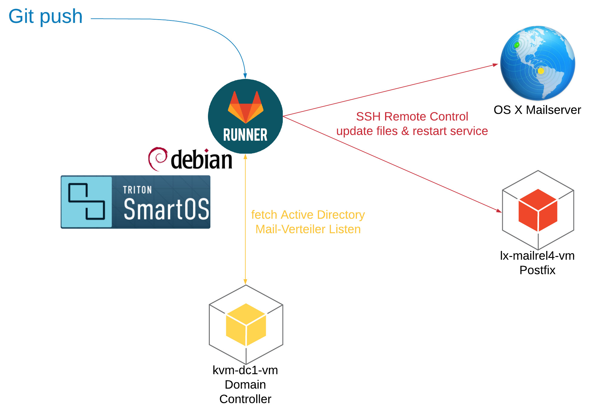

Requirement
===========

```
╭─root at lx-confmailverteiler in / using
╰─○ ls -all | grep custom
-rw-r--r--   1 gitlab-runner gitlab-runner  125 Feb 16 12:56 custom_dest_mailserver
-rw-r--r--   1 gitlab-runner gitlab-runner   97 Feb 16 12:57 custom_ldap_setting
╭─root at lx-confmailverteiler in / using
╰─○
```

TXT Scheme
==========

```
   merge: mail-verteiler_urlaub
                     |
                     |
                     V
   merge: mail-verteiler_mailbot
                     |
                     |
                     V
   merge: mail-verteiler_custom
             |       |
             |       |
             |       V
             |       ---> virtual_map (shortened version) ----------------> Postfix Container
             |
             |
             V
   merge: mail-verteiler from active-directory
             |
             |
             V
             -----------> virtual_map --------------------------------------> OS X Mailserver
                                          |---< (ohne mail-verteiler_urlaub)
                                          |---< (ohne mail-verteiler_mailbot)
```

Scheme
======



